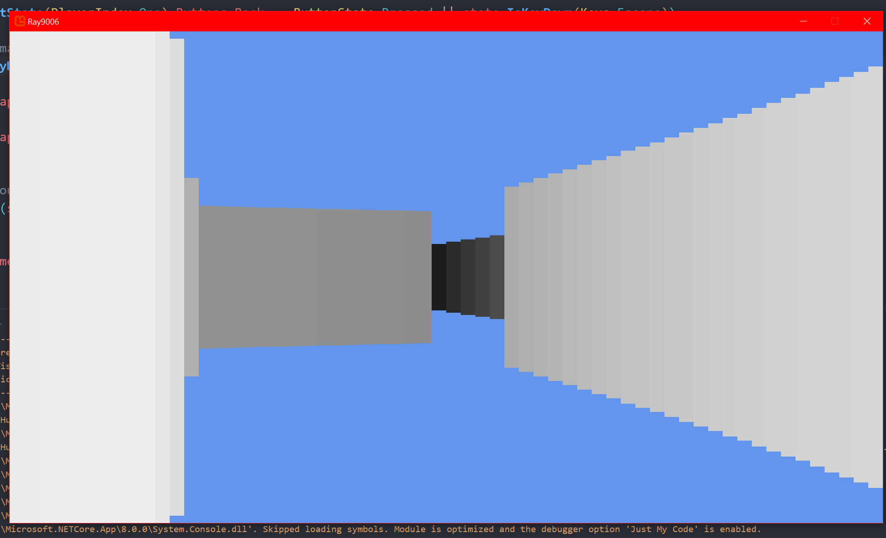
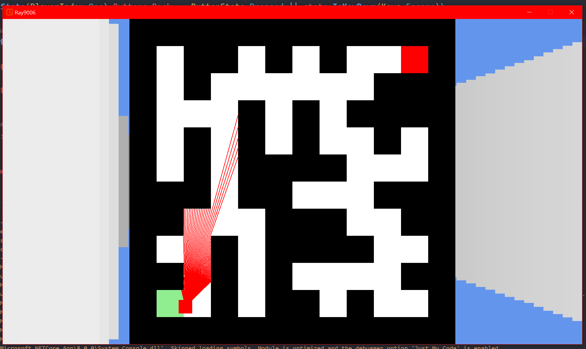
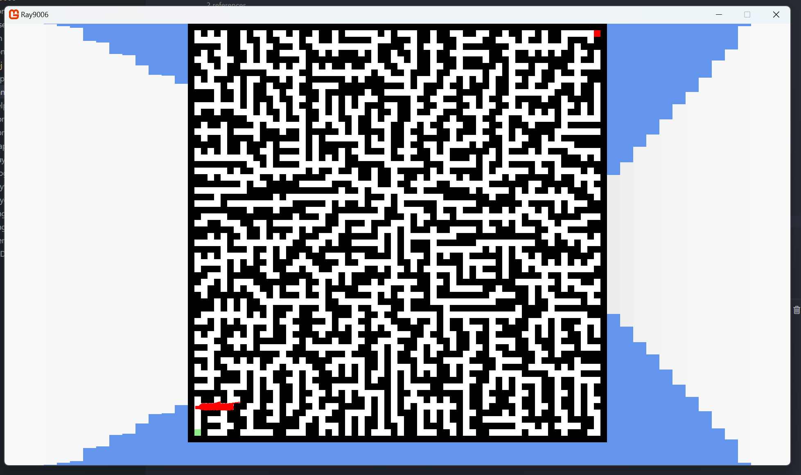

# lisaengs-raycasting
*ps never added a gitignore and didnt have enough energy to figure out how to do it after. sorry.*  
  
Simple maze runner application to satisfy all your needs.
Implements [Randomized Prim’s Algorithm](https://medium.com/swlh/fun-with-python-1-maze-generator-931639b4fb7e) as per an old unity project i made. The raycaster itself is inspired by this youtube tutorial: [Make Your Own Raycaster Part 1
](https://www.youtube.com/watch?v=gYRrGTC7GtA).

### Avalible keybinds
| Key | Function |
|--------|------------|
| W | Move forward |
| A | Strife left |
| S | Move backwards |
| D | Strife right |
| -> | Look left |
| <- | Look right |
| Space | Hold down to show minimap |

### Totally real game footage

*ps man kan också ha större labyrinter*

